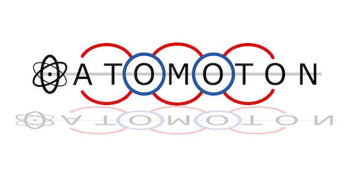

ATOMOTON

Overview:
Alternative to topotools, with more flexibility. Needs to be updated for speed.

Features:

To Do List:
-Porous Material Characterization (e.g., Pore Size Distribution, Surface Area (Geometric, Connolly), Powder X-Ray Diffraction, Helium Void Fraction, RDF?)

