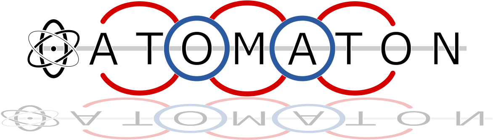

ATOMOTON

Overview: Alternative to topotools, with more flexibility.

Features:

- Caclulate Bonds, Angles, Diherals, Impropers
- Visualize structures and programatically generate images and gifs
- Build supercells, and insert molecules into crystals
- Generate LAMMPS input files

To Do List:

- Porous Material Characterization (e.g., Pore Size Distribution, Surface Area (Geometric, Connolly), Powder X-Ray Diffraction, Helium Void Fraction, RDF?).
- Refactor and add classes as needed (or repurpose ASE classes if possible)
  - Bond class? Simulation class (molecule ids, system params?), Forcefield class.
- Doc Strings
- Examples
- Travis CI/CD (?)
- Use RDKit to determine bond types, update drawn bonds to match style.
- Charge approximations (ex. eqEQ, import from dft). Need to better handle atom reasssignment if we are tracking more than positions. Good argument for shift to classes (this is why we design early!).
- SMILES/SELFIES support
- Generate computational chmeistry tool kit on top of ase stuff

Stuff to Read:

- Determining bond orders from distances non-trival, and solution didn't even exist in ase or RDKit until recently. This is an open source program to do that: https://greglandrum.github.io/rdkit-blog/posts/2022-12-18-introducing-rdDetermineBonds.html. It also demos a drawing function using IPythonConsole.
- MolecularDynamics in ASE: https://wiki.fysik.dtu.dk/ase/ase/md.html
- Harmonics Calculator: https://wiki.fysik.dtu.dk/ase/ase/calculators/harmonic.html (Also demos FF objects.)
- Structure Optimization: https://wiki.fysik.dtu.dk/ase/ase/optimize.html (Does not require FF?)
